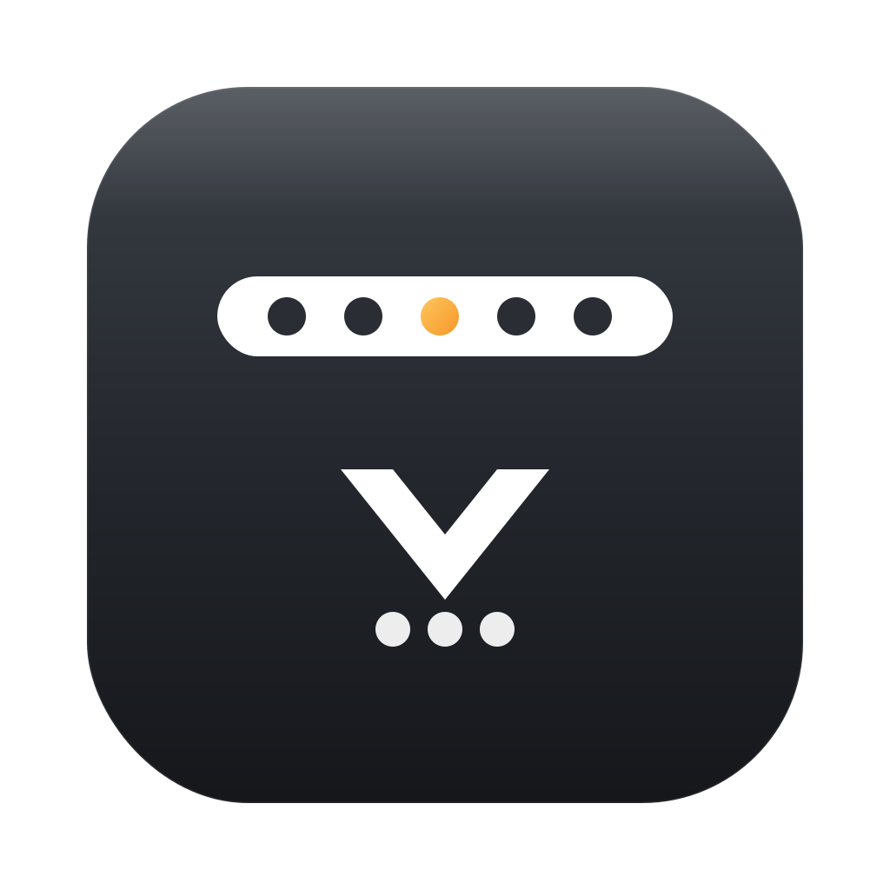

<div align="center">



# Barback

**가려진 맥 메뉴바 아이콘을, 다시 꺼내 쓰세요.**

노치·공간 부족으로 화면에서 사라진 메뉴바 아이콘을 한곳에 모아 보여주고,
클릭하면 그 앱의 **진짜 메뉴**가 열립니다. 아이콘 **순서 재배치**까지.

<br/>


[](https://github.com/joonlab/barback)

</div>

---

## 왜 Barback인가 (Why)

맥북은 **노치 + 좌측 앱 메뉴 + 수많은 상태 아이콘**이 좁은 메뉴바를 두고 경쟁합니다.
공간이 모자라면 macOS는 **아이콘을 그냥 숨겨버리고**, 접근할 방법을 주지 않습니다.

**Barback**은 그 가려진 아이콘들을 다시 손에 쥐여줍니다. 메뉴바의 `▦` 아이콘 하나만 누르면 돼요.

## ✨ 특징 (Features)

- 🫥 **가려진 아이콘까지 전부 수집** — 노치 뒤/공간 밖의 아이콘도 빠짐없이
- 🖼️ **진짜 아이콘 그대로** — ScreenCaptureKit으로 실제 메뉴바 아이콘을 캡처해 표시
- 🖱️ **클릭하면 진짜로 열림** — 보이는 아이템은 즉시, 숨은 아이템은 잠깐 끌어내 클릭 후 원위치
- ↔️ **순서 재배치** — 설정창에서 드래그로 메뉴바 아이콘 순서를 바꿈 (최소 이동으로 빠르게)
- 🪶 **가벼움** — 메뉴바 전용(Dock 아이콘 없음), 네이티브 Swift/AppKit
- 🌗 **다크 패널** — 메뉴바 미감에 맞춘 깔끔한 격자 팝업

## 🎬 동작 방식 (How it works)

```
        ┌──────────────── 메뉴바 (공간 부족) ────────────────┐
        │  … 가려진 아이콘들 …      [▦ Barback]   WiFi 🔋 🕙  │
        └────────────────────────────────────────────────────┘
                              │  클릭
                              ▼
              ┌───────────────────────────────┐
              │  ▢ ▢ ▢ ▢ ▢ ▢ ▢ ▢ ▢   ← 캡처된  │
              │  ▢ ▢ ▢ ▢ ▢ ▢ ▢ ▢ ▢     진짜    │
              │  ▢ ▢ ▢ ▢ ▢ ▢ ▢ ▢ ▢     아이콘  │
              └───────────────────────────────┘
                              │  아이콘 클릭
                              ▼
                    그 앱의 진짜 메뉴가 열림 ✅
```

1. 메뉴바의 **`▦` Barback 아이콘 클릭** → 가려진 것 포함 모든 메뉴바 아이콘이 **격자 패널**로 펼쳐짐
2. 패널에서 **아이콘 클릭** → 그 앱의 메뉴/팝오버가 실제로 열림
3. **우클릭 → "아이콘 순서 설정…"** → 드래그로 순서 재배치 후 적용

> 💡 스크린샷/GIF는 곧 추가 예정입니다.

## 🚀 설치 (Install)

### 빌드해서 설치
```bash
git clone https://github.com/joonlab/barback.git
cd barback
bash scripts/bundle.sh release          # → Barback.app (ad-hoc 서명)
cp -R Barback.app /Applications/
open -a Barback
```

### 권한 (필수)
독립 실행 시 아래 권한이 필요합니다 (시스템 설정 › 개인정보 보호 및 보안):
- **손쉬운 사용 (Accessibility)** — 아이콘 클릭·드래그 합성용
- **화면 기록 (Screen Recording)** — 아이콘 이미지 캡처용

### 로그인 시 자동 실행 (선택)
```bash
cp packaging/com.joonlab.barback.plist ~/Library/LaunchAgents/   # 저장소에 동봉 시
launchctl load ~/Library/LaunchAgents/com.joonlab.barback.plist
```
또는 시스템 설정 › 일반 › 로그인 항목에 `Barback.app` 추가.

## 🧩 아키텍처 (`Sources/Barback`)

| 파일 | 역할 |
|------|------|
| `main.swift` · `AppDelegate.swift` | accessory 앱 부트스트랩, 접근성 권한 요청 |
| `MenuBarController.swift` | `▦` 아이콘, 패널 토글, 클릭 라우팅(보임=직접 / 숨김=끌어내기) |
| `Bridging.swift` | 비공개 CGS API — 숨김 포함 메뉴바 윈도우 열거 |
| `MenuBarScanner.swift` | 열거 + 메인 디스플레이 필터 + ScreenCaptureKit 아이콘 캡처 |
| `ClickForwarder.swift` | 검증된 클릭 전달 (windowID `0x33` + 커서 워프 + hid tap) |
| `MenuBarMover.swift` | ⌘-드래그 합성으로 아이템 이동(끌어내기/숨기기/순서) |
| `RevealPanel.swift` | 캡처 아이콘 격자 팝업(NSPanel) |
| `SettingsWindowController.swift` · `ReorderApplier.swift` | 순서 재배치 설정창 + LCS 최소이동 적용 |

## 🔬 macOS 26 (Tahoe) 기법 메모

> 과거(Hidden Bar/Dozer 시절) 기법 다수가 Tahoe에서 바뀌어, **실측 검증한** 방법만 사용합니다.

- 메뉴바 아이템은 **Control Center가 호스팅** → 식별 대신 **아이콘을 캡처**해 표시
- 숨김 포함 열거 = 비공개 **`CGSGetProcessMenuBarWindowList`** (공개 API는 노치 뒤를 놓침)
- 클릭 = `CGEvent`에 비공개 **`windowID(0x33)`** + 커서 워프 + **`.cghidEventTap`**
- 숨김 아이템 끌어내기 = **⌘ 플래그 + windowID** 로 집어서 가시영역에 드롭
- 멀티 디스플레이 = 디스플레이마다 메뉴바가 떠 중복 → **메인 디스플레이로 필터**
- 합성 이벤트가 먹히려면 **서명된 .app + 손쉬운 사용 권한** 필요

## ⚠️ 알려진 한계

- 비공개 API 의존 → macOS 업데이트 시 동작이 바뀔 수 있음
- 시스템 아이콘(시계/와이파이 등)은 macOS가 고정 → 순서 이동 제한
- ad-hoc 서명 특성상 재빌드 시 권한(TCC) 재설정 필요

## 📄 라이선스 (License)

[MIT License](LICENSE) — © 2026 **JoonLab (준랩) · PARK JOON**

자유롭게 사용·복제·수정·배포할 수 있습니다. MIT 조건에 따라 **복제·포크·재배포 시 저작권 표시와 라이선스 전문을 포함**해 주세요(= 원작자 표기 유지).

## 🙏 크레딧 / 출처 표기 (Attribution)

포크하거나 코드를 가져다 쓰실 때는 원작자 **“JoonLab (준랩)”**을 밝혀 주세요:

> Based on **Barback** by JoonLab (준랩) — https://github.com/joonlab/barback

- macOS 26 메뉴바 조작 기법은 오픈소스 [**Ice**](https://github.com/jordanbaird/Ice)(GPLv3)를 **연구해 독립적으로 재구현**했습니다. Ice 소스를 복사하지 않았으며, 비공개 시스템 API 선언은 OS가 정한 인터페이스(사실)입니다.

## 🤝 기여 (Contributing)

이슈/PR 환영합니다. 비공개 API 의존 특성상, 버그 리포트 시 **macOS 버전 / 디스플레이 구성**을 함께 적어 주세요.

<div align="center">
<br/>
<sub>Made with ☕ by <b>JoonLab (준랩)</b></sub>
</div>
